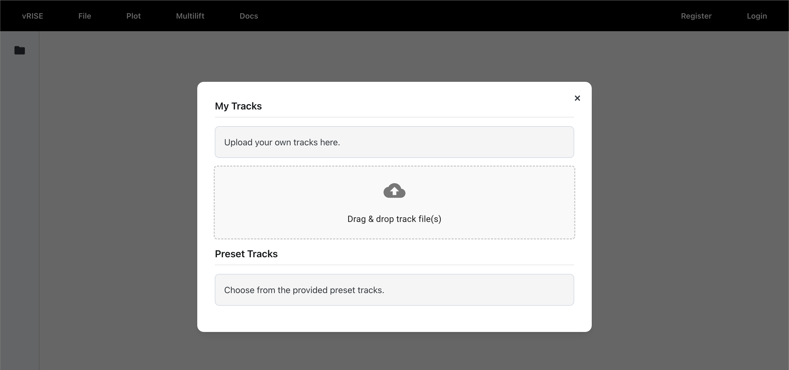
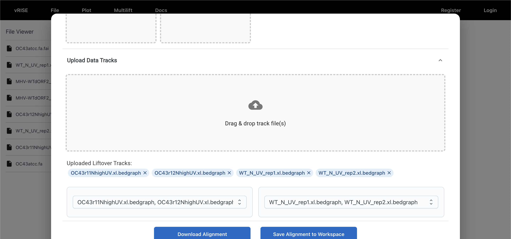
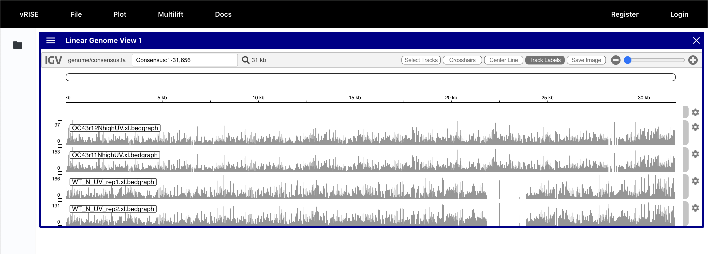
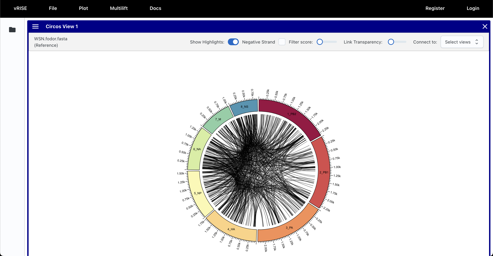
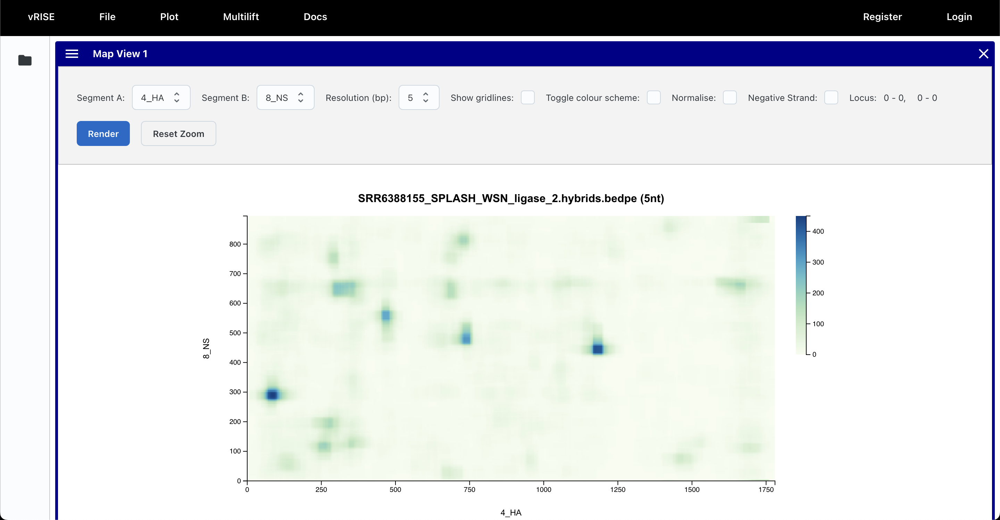

<!-- # vRISE

The Viral RNA Interaction and Structure Explorer is a genome browser aimed at aiding in understanding the structure and interactions governing RNA molecules. The browser consists of two main components, the frontend (known as `web` in the repo) and the backend. The frontend is responsible for the rendering logic whilst the backend carries out the heavylift for pre-processing data to be visualised by the frontend.

The project can either be hosted centrally and served to a range of users using a dedicated server, or run standalone on your local machine. A dedicated server would be better suited if you already have a user management system in place which can be integrated to vRISE using a dedicated SSO. A stand alone instance is better suited if you are working alone and only require the tool infrequently.

## Quick start

After cloning the repository, the frontend and backend have to be spun up separately.

```
cd web && npm run build
```

Poetry is a package manager used to declare library dependencies in Python. If you are running the project for the first time, you may need to install `poetry` first (https://python-poetry.org/docs/). Following the installation you need to install all the python dependencies required by the project.
```
poetry init
```

```
poetry shell
```

```
poetry run manage.py runserver
```

### Supported visualisations
#### Linear Genome View
#### Circos View
#### Map View -->

# vRISE: Quick Start & Overview

vRISE (**Viral RNA Interaction and Structure Explorer**) is an immersive, multi-modal genome browser built for **comparative viral genomics** and **structurome data**.  
It unifies sequence alignment, annotation liftover, and interactive multi-view visualisation in a single platform.

---

## Quick Start

1. **Upload your genomes and data tracks**  
   - Supported formats include FASTA, BED, GTF, BedGraph, VCF, dot-bracket, BEDPE, and Hi-C.  

    

2. **Run Multilift**  
   - Aligns multiple genomes via MSA.  
   - Generates a **consensus pan-reference** and liftover mappings for all uploaded tracks.

   

3. **Open visualisation views**  
   - Choose between **Linear Genome View**, **Circos Overview**, or **Interaction Matrix**.  
   - Views are synchronised: selecting a region in one updates the others.  

4. **Explore your data interactively**  
   - Hover for coordinate tooltips, filter interactions, zoom into subregions, and bookmark/share sessions.  

---

## Key Views

### Linear Genome View


- Built on **IGV panels**, aligned to a **pan-genome axis** from Multilift.  
- Overlay annotations, quantitative signals, variants, and RNA–RNA interaction arcs.  
- Hover tooltips show both **strain-specific** and **consensus** coordinates.  
- Selections propagate to Circos and Matrix views.


---

### Circos Overview


- Circular layout with each genome/segment as an arc.  
- **Ribbons** connect homologous or interacting loci (from Multilift indices or RNA interaction assays).  
- Supports filtering by score or segment, and adding mini-tracks (coverage/reactivity).  
- Designed for **at-a-glance comparisons** across multiple viral isolates.

---

### Interaction Matrix (Heatmap View)

- Displays **contact frequencies** or **co-reactivity scores** in a two-dimensional heatmap.  
- Features:  
  - Full-genome or zoomable sub-matrices  
  - Axis annotations for genes/domains  
  - Drag-selection updates Linear and Circos views.  

---

### Dynamic Liftover
- Multilift can be re-run **on demand** when adding new genomes/tracks.  
- Outputs are stored to the session and rendered instantly without reload.  

---

## Multilift: Coordinate Unification

**Multilift** is the core backend framework that enables vRISE’s multi-strain support.  

- **Inputs**: FASTA genomes + annotations (BED, GTF, BedGraph, dot-bracket, etc.).  
- **Pipeline**:  
  1. **Sequence ingestion & grouping**  
  2. **Multiple sequence alignment** (MAFFT/Clustal/Kalign/Muscle)  
  3. **Consensus construction** per group  
  4. **Lifter object** for coordinate mapping  
  5. **Liftover** of annotations & experimental data into the consensus pan-genome  

- **Outputs**:  
  - Consensus FASTA + index  
  - Alignment MAF files  
  - Lifted annotation/data files  
  - Packaged archive (tar/zip) with all artifacts  

> 📌 Multilift ensures that **all strains can be browsed in lockstep**, eliminating manual liftover steps.

---

## Architecture Overview

![placeholder for architecture diagram]

vRISE combines a **Next.js + React frontend** with a **Django backend**, integrated through a centralised state system.

- **Frontend Views**  
  - Linear Genome (IGV panels)  
  - Circos (D3 rendering)  
  - Heatmap / Matrix (HTML Canvas)  
  - Map plots (Canvas for efficiency with large data)  

- **Backend Services**  
  - Multilift for on-the-fly coordinate unification  
  - File management and track ingestion  
  - Session persistence  

- **State & Session Management**  
  - Each user session is captured as a **JSON object**, storing:  
    - Active views and configurations  
    - User uploads  
    - Cross-view connections and dependencies  
  - Enables **reproducible, shareable sessions**.  

- **Cross-View Linking**  
  - Actions in one view (e.g., zoom, selection) trigger updates in others.  
  - Achieved via a **global action handler** tied to the session state.  

---

## Summary

- **vRISE** bridges the gap between **linear browsers**, **circular overviews**, and **interaction matrices**.  
- **Multilift** powers pan-genome alignment and liftover, enabling multi-strain comparative analysis.  
- **Architecture** ensures interactivity, reproducibility, and collaborative workflows.  

For source code and deployment instructions, see the [GitHub repository](https://github.com/mithun-sri/vrise).
